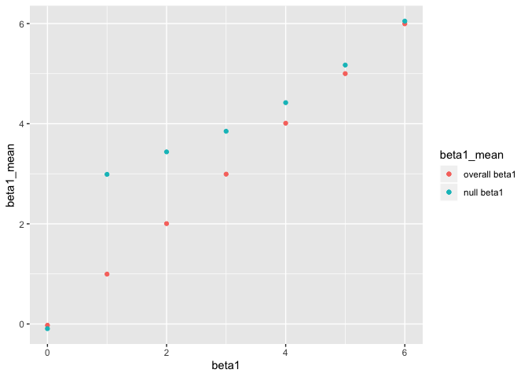

HW 5 updated
================
Kelly Wang, kzw2102

### Problem 1

  - fill in missing numeric values with the mean of the non-missing
    values
  - character variables, fill in missing values with “virginica”

<!-- end list -->

``` r
replace_missing = function(x) {
  if (is.character(x)) {
    x=replace(x, is.na(x), "virginica")
  } else {
    mean_x=mean(x, na.rm=TRUE)
    x=replace(x, is.na(x), mean_x)
  }
}

output = map_dfr(iris_with_missing, replace_missing)

output
```

    ## # A tibble: 150 x 5
    ##    Sepal.Length Sepal.Width Petal.Length Petal.Width Species
    ##           <dbl>       <dbl>        <dbl>       <dbl> <chr>  
    ##  1         5.1          3.5         1.4         0.2  setosa 
    ##  2         4.9          3           1.4         0.2  setosa 
    ##  3         4.7          3.2         1.3         0.2  setosa 
    ##  4         4.6          3.1         1.5         1.19 setosa 
    ##  5         5            3.6         1.4         0.2  setosa 
    ##  6         5.4          3.9         1.7         0.4  setosa 
    ##  7         5.82         3.4         1.4         0.3  setosa 
    ##  8         5            3.4         1.5         0.2  setosa 
    ##  9         4.4          2.9         1.4         0.2  setosa 
    ## 10         4.9          3.1         3.77        0.1  setosa 
    ## # … with 140 more rows

The new output dataframe contains 150 rows and 5 columns, where each row
contains a unique value. Those originally with numeric values were
replaced with the mean of the non-missing values and those originally
with missing characters were replaced with “virginica”. Variables
include length of Sepal, width of Sepal, length of Petal, width of
Petal, and the species.

## Problem 2

``` r
#TA wise words
data_problem2=tibble(
  files=list.files(path="./data/data"),
  path=str_c("./data/data/",files)
) %>% 
  mutate(data = map(path, read_csv)) %>% 
  unnest()
```

    ## Parsed with column specification:
    ## cols(
    ##   week_1 = col_double(),
    ##   week_2 = col_double(),
    ##   week_3 = col_double(),
    ##   week_4 = col_double(),
    ##   week_5 = col_double(),
    ##   week_6 = col_double(),
    ##   week_7 = col_double(),
    ##   week_8 = col_double()
    ## )
    ## Parsed with column specification:
    ## cols(
    ##   week_1 = col_double(),
    ##   week_2 = col_double(),
    ##   week_3 = col_double(),
    ##   week_4 = col_double(),
    ##   week_5 = col_double(),
    ##   week_6 = col_double(),
    ##   week_7 = col_double(),
    ##   week_8 = col_double()
    ## )
    ## Parsed with column specification:
    ## cols(
    ##   week_1 = col_double(),
    ##   week_2 = col_double(),
    ##   week_3 = col_double(),
    ##   week_4 = col_double(),
    ##   week_5 = col_double(),
    ##   week_6 = col_double(),
    ##   week_7 = col_double(),
    ##   week_8 = col_double()
    ## )
    ## Parsed with column specification:
    ## cols(
    ##   week_1 = col_double(),
    ##   week_2 = col_double(),
    ##   week_3 = col_double(),
    ##   week_4 = col_double(),
    ##   week_5 = col_double(),
    ##   week_6 = col_double(),
    ##   week_7 = col_double(),
    ##   week_8 = col_double()
    ## )
    ## Parsed with column specification:
    ## cols(
    ##   week_1 = col_double(),
    ##   week_2 = col_double(),
    ##   week_3 = col_double(),
    ##   week_4 = col_double(),
    ##   week_5 = col_double(),
    ##   week_6 = col_double(),
    ##   week_7 = col_double(),
    ##   week_8 = col_double()
    ## )
    ## Parsed with column specification:
    ## cols(
    ##   week_1 = col_double(),
    ##   week_2 = col_double(),
    ##   week_3 = col_double(),
    ##   week_4 = col_double(),
    ##   week_5 = col_double(),
    ##   week_6 = col_double(),
    ##   week_7 = col_double(),
    ##   week_8 = col_double()
    ## )
    ## Parsed with column specification:
    ## cols(
    ##   week_1 = col_double(),
    ##   week_2 = col_double(),
    ##   week_3 = col_double(),
    ##   week_4 = col_double(),
    ##   week_5 = col_double(),
    ##   week_6 = col_double(),
    ##   week_7 = col_double(),
    ##   week_8 = col_double()
    ## )
    ## Parsed with column specification:
    ## cols(
    ##   week_1 = col_double(),
    ##   week_2 = col_double(),
    ##   week_3 = col_double(),
    ##   week_4 = col_double(),
    ##   week_5 = col_double(),
    ##   week_6 = col_double(),
    ##   week_7 = col_double(),
    ##   week_8 = col_double()
    ## )
    ## Parsed with column specification:
    ## cols(
    ##   week_1 = col_double(),
    ##   week_2 = col_double(),
    ##   week_3 = col_double(),
    ##   week_4 = col_double(),
    ##   week_5 = col_double(),
    ##   week_6 = col_double(),
    ##   week_7 = col_double(),
    ##   week_8 = col_double()
    ## )
    ## Parsed with column specification:
    ## cols(
    ##   week_1 = col_double(),
    ##   week_2 = col_double(),
    ##   week_3 = col_double(),
    ##   week_4 = col_double(),
    ##   week_5 = col_double(),
    ##   week_6 = col_double(),
    ##   week_7 = col_double(),
    ##   week_8 = col_double()
    ## )
    ## Parsed with column specification:
    ## cols(
    ##   week_1 = col_double(),
    ##   week_2 = col_double(),
    ##   week_3 = col_double(),
    ##   week_4 = col_double(),
    ##   week_5 = col_double(),
    ##   week_6 = col_double(),
    ##   week_7 = col_double(),
    ##   week_8 = col_double()
    ## )
    ## Parsed with column specification:
    ## cols(
    ##   week_1 = col_double(),
    ##   week_2 = col_double(),
    ##   week_3 = col_double(),
    ##   week_4 = col_double(),
    ##   week_5 = col_double(),
    ##   week_6 = col_double(),
    ##   week_7 = col_double(),
    ##   week_8 = col_double()
    ## )
    ## Parsed with column specification:
    ## cols(
    ##   week_1 = col_double(),
    ##   week_2 = col_double(),
    ##   week_3 = col_double(),
    ##   week_4 = col_double(),
    ##   week_5 = col_double(),
    ##   week_6 = col_double(),
    ##   week_7 = col_double(),
    ##   week_8 = col_double()
    ## )
    ## Parsed with column specification:
    ## cols(
    ##   week_1 = col_double(),
    ##   week_2 = col_double(),
    ##   week_3 = col_double(),
    ##   week_4 = col_double(),
    ##   week_5 = col_double(),
    ##   week_6 = col_double(),
    ##   week_7 = col_double(),
    ##   week_8 = col_double()
    ## )
    ## Parsed with column specification:
    ## cols(
    ##   week_1 = col_double(),
    ##   week_2 = col_double(),
    ##   week_3 = col_double(),
    ##   week_4 = col_double(),
    ##   week_5 = col_double(),
    ##   week_6 = col_double(),
    ##   week_7 = col_double(),
    ##   week_8 = col_double()
    ## )
    ## Parsed with column specification:
    ## cols(
    ##   week_1 = col_double(),
    ##   week_2 = col_double(),
    ##   week_3 = col_double(),
    ##   week_4 = col_double(),
    ##   week_5 = col_double(),
    ##   week_6 = col_double(),
    ##   week_7 = col_double(),
    ##   week_8 = col_double()
    ## )
    ## Parsed with column specification:
    ## cols(
    ##   week_1 = col_double(),
    ##   week_2 = col_double(),
    ##   week_3 = col_double(),
    ##   week_4 = col_double(),
    ##   week_5 = col_double(),
    ##   week_6 = col_double(),
    ##   week_7 = col_double(),
    ##   week_8 = col_double()
    ## )
    ## Parsed with column specification:
    ## cols(
    ##   week_1 = col_double(),
    ##   week_2 = col_double(),
    ##   week_3 = col_double(),
    ##   week_4 = col_double(),
    ##   week_5 = col_double(),
    ##   week_6 = col_double(),
    ##   week_7 = col_double(),
    ##   week_8 = col_double()
    ## )
    ## Parsed with column specification:
    ## cols(
    ##   week_1 = col_double(),
    ##   week_2 = col_double(),
    ##   week_3 = col_double(),
    ##   week_4 = col_double(),
    ##   week_5 = col_double(),
    ##   week_6 = col_double(),
    ##   week_7 = col_double(),
    ##   week_8 = col_double()
    ## )
    ## Parsed with column specification:
    ## cols(
    ##   week_1 = col_double(),
    ##   week_2 = col_double(),
    ##   week_3 = col_double(),
    ##   week_4 = col_double(),
    ##   week_5 = col_double(),
    ##   week_6 = col_double(),
    ##   week_7 = col_double(),
    ##   week_8 = col_double()
    ## )

    ## Warning: `cols` is now required.
    ## Please use `cols = c(data)`

``` r
## change file names to include control arm and subject ID
## make sure weekly observations are tidy
data_problem2_tidy= 
  data_problem2 %>% 
  janitor::clean_names() %>% 
  pivot_longer(
    week_1:week_8,
    names_to="Week",
    names_prefix="week_",
    values_to="Observation"
  ) %>% 
  select(files, Week, Observation) %>% 
  mutate(
    Arm = str_replace(files,"_[0-9][0-9].csv",""),
    Arm = recode(Arm, "con"="Control", "exp"="Experiment"),
    ID = str_replace(files, ".csv", " ")
  ) %>% 
  select(ID, Arm, Week, Observation, -files)
  

# spaghetti plot by group
data_problem2_tidy %>% 
  ggplot(aes(x = Week, y = Observation, group = ID, color= Arm)) + 
  geom_line() +
  labs(
    title = "Individual Observation over 8-Week Period"
  )
```

<!-- --> Here we
have a tidy datafram containing 160 rows and 4 columns. Variables
include the subject ID, control arm, the week in which they were
observed, and their observations. A total of 20 individuals participated
in the study. Here we can see that the control arms tend to have lower
observations than the experiment arms during this 8 week study period.

### Problem 3:

``` r
sim_regression = function(n=30, beta0 = 2, beta1=0) {
  
  sim_data = tibble(
    x = rnorm(n, mean = 0, sd=1),
    y = beta0 + beta1 * x + rnorm(n, 0, 50)
  )
  
  ls_fit = lm(y ~ x, data = sim_data) %>% 
    broom::tidy() %>% 
    select(term, estimate, p.value)

}

##trying this outside of the dataframe
sim_results =
  rerun(100, sim_regression(n=30, beta0=2, beta1=0)) %>% 
  bind_rows()

##Generating 10000 datasets from the model
sim_results = 
  tibble(beta1 =c(0:6)) %>% 
  mutate(
    output_lists=map(.x= beta1, ~rerun(10000, sim_regression(beta1 =.x))),
    estimate_p.value=map(output_lists, bind_rows)
  ) %>% 
  select(-output_lists) %>% 
  unnest(estimate_p.value)

sim_results
```

    ## # A tibble: 140,000 x 4
    ##    beta1 term        estimate p.value
    ##    <int> <chr>          <dbl>   <dbl>
    ##  1     0 (Intercept)    1.03   0.906 
    ##  2     0 x              5.60   0.624 
    ##  3     0 (Intercept)   -0.263  0.978 
    ##  4     0 x             26.0    0.0182
    ##  5     0 (Intercept)    3.63   0.732 
    ##  6     0 x            -10.4    0.385 
    ##  7     0 (Intercept)   -4.92   0.503 
    ##  8     0 x             -4.31   0.539 
    ##  9     0 (Intercept)   12.9    0.289 
    ## 10     0 x             -1.14   0.943 
    ## # … with 139,990 more rows

``` r
head(sim_results) %>% knitr::kable()
```

| beta1 | term        |     estimate |   p.value |
| ----: | :---------- | -----------: | --------: |
|     0 | (Intercept) |    1.0264403 | 0.9063299 |
|     0 | x           |    5.6027699 | 0.6236058 |
|     0 | (Intercept) |  \-0.2625772 | 0.9778402 |
|     0 | x           |   26.0043472 | 0.0181979 |
|     0 | (Intercept) |    3.6292801 | 0.7321273 |
|     0 | x           | \-10.4212173 | 0.3849481 |

Here we can see the first few lines of the total 140000 rows in our
dataset. We will be using this simulated dataset and plot the
relationship between power and effect size and see if there is a
difference betweeen average betas among the whole sample vs those with
p\<0.05.

### Proportion of times the null was rejected (the power of the test) on the y axis and true value of beta1 on the xaxis. Relationship between effect size and power. Here are the first lines of the table of estimates of beta1 and of the resulting p-value.

``` r
sim_results %>% 
  group_by(beta1) %>% 
  summarize(
    total=n(),
    count_reject=sum(p.value<0.05),
    proportion = count_reject/n()
  ) %>% 
  ggplot(aes(x=beta1, y=proportion)) +
  geom_point()+
  geom_line()+
  theme_classic()+
  labs(
    title = " Power of test vs true value of beta1",
    x="Effect Size",
    y= "Power"
  )
```

<!-- -->
We can see that as effect size gets larger, power increases. There have
a positive linear
relationship.

### Plot showing the average estimate of beta1 on y axis and true value of beta1 on the xaxis with another plot showing average estimate of beta1 only in samples in which the null was rejected on the y axis and true value of beta1 on the x axis.

``` r
overall_df =
sim_results %>% 
  group_by(beta1) %>% 
  summarize(
    beta1_mean= mean(estimate)
  )
  
reject_df=
  sim_results %>% 
  filter(p.value<0.05) %>% 
  group_by(beta1) %>% 
  summarize(
    beta1_mean_reject= mean(estimate)
  )

combined_df =
  left_join(overall_df, reject_df, by = "beta1")

ggplot(data=combined_df, aes(x=beta1, y=beta1_mean, color=beta1_mean)) +
  geom_point(aes(x=beta1, y=beta1_mean, xlab="beta1", ylab="mean", color="blue"))+
  geom_point(aes(x=beta1, y=beta1_mean_reject, xlab="beta1", ylab="mean", color="red")) + scale_color_hue(labels=c('overall beta1', 'null beta1'))
```

    ## Warning: Ignoring unknown aesthetics: xlab, ylab
    
    ## Warning: Ignoring unknown aesthetics: xlab, ylab

<!-- -->
Here we can see that sample average for beta1 across tests in which the
null is rejected (here we see it is in the color red ) is much lower
than the average for beta1 across all the tests. This would make sense
since the more extreme the betas are, the smaller the would be.
