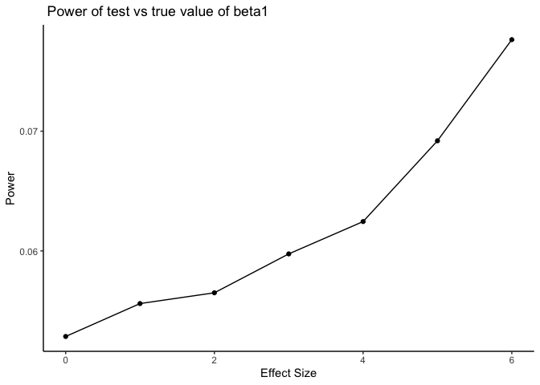

HW 5
================

# Problem 1

  - fill in missing numeric values with the mean of the non-missing
    values

  - character variables, fill in missing values with “virginica”

  - writing a function that takes a vector as an argument

  - replaces missing values using rules defined above

  - returns the returning vector

  - applying this function to the columns of iris\_meaning\_missing
    using map statement

<!-- end list -->

``` r
replace_missing = function(x) {
  if (is.character(x)) {
    x=replace(x, is.na(x), "virginica")
  } else {
    mean_x=mean(x, na.rm=TRUE)
    x=replace(x, is.na(x), mean_x)
  }
}

output = map_dfr(iris_with_missing, replace_missing)

output
```

    ## # A tibble: 150 x 5
    ##    Sepal.Length Sepal.Width Petal.Length Petal.Width Species
    ##           <dbl>       <dbl>        <dbl>       <dbl> <chr>  
    ##  1         5.1          3.5         1.4         0.2  setosa 
    ##  2         4.9          3           1.4         0.2  setosa 
    ##  3         4.7          3.2         1.3         0.2  setosa 
    ##  4         4.6          3.1         1.5         1.19 setosa 
    ##  5         5            3.6         1.4         0.2  setosa 
    ##  6         5.4          3.9         1.7         0.4  setosa 
    ##  7         5.82         3.4         1.4         0.3  setosa 
    ##  8         5            3.4         1.5         0.2  setosa 
    ##  9         4.4          2.9         1.4         0.2  setosa 
    ## 10         4.9          3.1         3.77        0.1  setosa 
    ## # … with 140 more rows

## Problem 2

``` r
#TA wise words
data_problem2=tibble(
  files=list.files(path="./data/data"),
  path=str_c("./data/data/",files)
) %>% 
  mutate(data = map(path, read_csv)) %>% 
  unnest()
```

    ## Parsed with column specification:
    ## cols(
    ##   week_1 = col_double(),
    ##   week_2 = col_double(),
    ##   week_3 = col_double(),
    ##   week_4 = col_double(),
    ##   week_5 = col_double(),
    ##   week_6 = col_double(),
    ##   week_7 = col_double(),
    ##   week_8 = col_double()
    ## )
    ## Parsed with column specification:
    ## cols(
    ##   week_1 = col_double(),
    ##   week_2 = col_double(),
    ##   week_3 = col_double(),
    ##   week_4 = col_double(),
    ##   week_5 = col_double(),
    ##   week_6 = col_double(),
    ##   week_7 = col_double(),
    ##   week_8 = col_double()
    ## )
    ## Parsed with column specification:
    ## cols(
    ##   week_1 = col_double(),
    ##   week_2 = col_double(),
    ##   week_3 = col_double(),
    ##   week_4 = col_double(),
    ##   week_5 = col_double(),
    ##   week_6 = col_double(),
    ##   week_7 = col_double(),
    ##   week_8 = col_double()
    ## )
    ## Parsed with column specification:
    ## cols(
    ##   week_1 = col_double(),
    ##   week_2 = col_double(),
    ##   week_3 = col_double(),
    ##   week_4 = col_double(),
    ##   week_5 = col_double(),
    ##   week_6 = col_double(),
    ##   week_7 = col_double(),
    ##   week_8 = col_double()
    ## )
    ## Parsed with column specification:
    ## cols(
    ##   week_1 = col_double(),
    ##   week_2 = col_double(),
    ##   week_3 = col_double(),
    ##   week_4 = col_double(),
    ##   week_5 = col_double(),
    ##   week_6 = col_double(),
    ##   week_7 = col_double(),
    ##   week_8 = col_double()
    ## )
    ## Parsed with column specification:
    ## cols(
    ##   week_1 = col_double(),
    ##   week_2 = col_double(),
    ##   week_3 = col_double(),
    ##   week_4 = col_double(),
    ##   week_5 = col_double(),
    ##   week_6 = col_double(),
    ##   week_7 = col_double(),
    ##   week_8 = col_double()
    ## )
    ## Parsed with column specification:
    ## cols(
    ##   week_1 = col_double(),
    ##   week_2 = col_double(),
    ##   week_3 = col_double(),
    ##   week_4 = col_double(),
    ##   week_5 = col_double(),
    ##   week_6 = col_double(),
    ##   week_7 = col_double(),
    ##   week_8 = col_double()
    ## )
    ## Parsed with column specification:
    ## cols(
    ##   week_1 = col_double(),
    ##   week_2 = col_double(),
    ##   week_3 = col_double(),
    ##   week_4 = col_double(),
    ##   week_5 = col_double(),
    ##   week_6 = col_double(),
    ##   week_7 = col_double(),
    ##   week_8 = col_double()
    ## )
    ## Parsed with column specification:
    ## cols(
    ##   week_1 = col_double(),
    ##   week_2 = col_double(),
    ##   week_3 = col_double(),
    ##   week_4 = col_double(),
    ##   week_5 = col_double(),
    ##   week_6 = col_double(),
    ##   week_7 = col_double(),
    ##   week_8 = col_double()
    ## )
    ## Parsed with column specification:
    ## cols(
    ##   week_1 = col_double(),
    ##   week_2 = col_double(),
    ##   week_3 = col_double(),
    ##   week_4 = col_double(),
    ##   week_5 = col_double(),
    ##   week_6 = col_double(),
    ##   week_7 = col_double(),
    ##   week_8 = col_double()
    ## )
    ## Parsed with column specification:
    ## cols(
    ##   week_1 = col_double(),
    ##   week_2 = col_double(),
    ##   week_3 = col_double(),
    ##   week_4 = col_double(),
    ##   week_5 = col_double(),
    ##   week_6 = col_double(),
    ##   week_7 = col_double(),
    ##   week_8 = col_double()
    ## )
    ## Parsed with column specification:
    ## cols(
    ##   week_1 = col_double(),
    ##   week_2 = col_double(),
    ##   week_3 = col_double(),
    ##   week_4 = col_double(),
    ##   week_5 = col_double(),
    ##   week_6 = col_double(),
    ##   week_7 = col_double(),
    ##   week_8 = col_double()
    ## )
    ## Parsed with column specification:
    ## cols(
    ##   week_1 = col_double(),
    ##   week_2 = col_double(),
    ##   week_3 = col_double(),
    ##   week_4 = col_double(),
    ##   week_5 = col_double(),
    ##   week_6 = col_double(),
    ##   week_7 = col_double(),
    ##   week_8 = col_double()
    ## )
    ## Parsed with column specification:
    ## cols(
    ##   week_1 = col_double(),
    ##   week_2 = col_double(),
    ##   week_3 = col_double(),
    ##   week_4 = col_double(),
    ##   week_5 = col_double(),
    ##   week_6 = col_double(),
    ##   week_7 = col_double(),
    ##   week_8 = col_double()
    ## )
    ## Parsed with column specification:
    ## cols(
    ##   week_1 = col_double(),
    ##   week_2 = col_double(),
    ##   week_3 = col_double(),
    ##   week_4 = col_double(),
    ##   week_5 = col_double(),
    ##   week_6 = col_double(),
    ##   week_7 = col_double(),
    ##   week_8 = col_double()
    ## )
    ## Parsed with column specification:
    ## cols(
    ##   week_1 = col_double(),
    ##   week_2 = col_double(),
    ##   week_3 = col_double(),
    ##   week_4 = col_double(),
    ##   week_5 = col_double(),
    ##   week_6 = col_double(),
    ##   week_7 = col_double(),
    ##   week_8 = col_double()
    ## )
    ## Parsed with column specification:
    ## cols(
    ##   week_1 = col_double(),
    ##   week_2 = col_double(),
    ##   week_3 = col_double(),
    ##   week_4 = col_double(),
    ##   week_5 = col_double(),
    ##   week_6 = col_double(),
    ##   week_7 = col_double(),
    ##   week_8 = col_double()
    ## )
    ## Parsed with column specification:
    ## cols(
    ##   week_1 = col_double(),
    ##   week_2 = col_double(),
    ##   week_3 = col_double(),
    ##   week_4 = col_double(),
    ##   week_5 = col_double(),
    ##   week_6 = col_double(),
    ##   week_7 = col_double(),
    ##   week_8 = col_double()
    ## )
    ## Parsed with column specification:
    ## cols(
    ##   week_1 = col_double(),
    ##   week_2 = col_double(),
    ##   week_3 = col_double(),
    ##   week_4 = col_double(),
    ##   week_5 = col_double(),
    ##   week_6 = col_double(),
    ##   week_7 = col_double(),
    ##   week_8 = col_double()
    ## )
    ## Parsed with column specification:
    ## cols(
    ##   week_1 = col_double(),
    ##   week_2 = col_double(),
    ##   week_3 = col_double(),
    ##   week_4 = col_double(),
    ##   week_5 = col_double(),
    ##   week_6 = col_double(),
    ##   week_7 = col_double(),
    ##   week_8 = col_double()
    ## )

    ## Warning: `cols` is now required.
    ## Please use `cols = c(data)`

``` r
## change file names to include control arm and subject ID
## make sure weekly observations are tidy
data_problem2_tidy= 
  data_problem2 %>% 
  janitor::clean_names() %>% 
  pivot_longer(
    week_1:week_8,
    names_to="Week",
    names_prefix="week_",
    values_to="Observation"
  ) %>% 
  select(files, Week, Observation) %>% 
  mutate(
    Arm = str_replace(files,"_[0-9][0-9].csv",""),
    Arm = recode(Arm, "con"="Control", "exp"="Experiment"),
    ID = str_replace(files, ".csv", " ")
  ) %>% 
  select(ID, Arm, Week, Observation, -files)
  

# spaghetti plot by group
data_problem2_tidy %>% 
  ggplot(aes(x = Week, y = Observation, group = ID, color= Arm)) + 
  geom_line() +
  labs(
    title = "Individual Observation over 8-Week Period"
  )
```

<!-- -->

### Problem 3:

``` r
sim_regression = function(n=30, beta0 = 2, beta1=0) {
  
  sim_data = tibble(
    x = rnorm(n, mean = 0, sd=1),
    y = beta0 + beta1 * x + rnorm(n, 0, 50)
  )
  
  ls_fit = lm(y ~ x, data = sim_data) %>% 
    broom::tidy() %>% 
    select(term, estimate, p.value)

}

##trying this outside of the dataframe
sim_results =
  rerun(100, sim_regression(n=30, beta0=2, beta1=0)) %>% 
  bind_rows()

##Generating 10000 datasets from the model
sim_results = 
  tibble(beta1 =c(0:6)) %>% 
  mutate(
    output_lists=map(.x= beta1, ~rerun(10000, sim_regression(beta1 =.x))),
    estimate_p.value=map(output_lists, bind_rows)
  ) %>% 
  select(-output_lists) %>% 
  unnest(estimate_p.value)

sim_results
```

    ## # A tibble: 140,000 x 4
    ##    beta1 term        estimate p.value
    ##    <int> <chr>          <dbl>   <dbl>
    ##  1     0 (Intercept)    1.03   0.906 
    ##  2     0 x              5.60   0.624 
    ##  3     0 (Intercept)   -0.263  0.978 
    ##  4     0 x             26.0    0.0182
    ##  5     0 (Intercept)    3.63   0.732 
    ##  6     0 x            -10.4    0.385 
    ##  7     0 (Intercept)   -4.92   0.503 
    ##  8     0 x             -4.31   0.539 
    ##  9     0 (Intercept)   12.9    0.289 
    ## 10     0 x             -1.14   0.943 
    ## # … with 139,990 more rows

### Proportion of times the null was rejected (the power of the test) on the y axis and true value of beta1 on the xaxis. Relationship between effect size and power

``` r
sim_results %>% 
  group_by(beta1) %>% 
  summarize(
    total=n(),
    count_reject=sum(p.value<0.05),
    proportion=count_reject/n()
  ) %>% 
  ggplot(aes(x=beta1, y=proportion)) +
  geom_point()+
  theme_classic()+
  labs(
    title = " Power of test vs true value of beta1 "
  )
```

<!-- -->
\#\#\# Plot showing the average estimate of beta1 on y axis and true
value of beta1 on the xaxis with another plot showing average estimate
of beta1 only in samples in which the null was rejected on the y axis
and true value of beta1 on the x axis.
